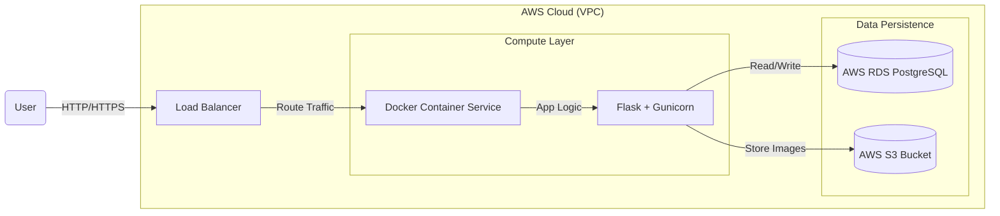

<div align="center">

# ☁️ Advance Inventory Manager (Cloud Native)

### Enterprise-Grade POS & Inventory System on AWS


<p align="center">
  <a href="#-architecture">Architecture</a> •
  <a href="#-key-features">Features</a> •
  <a href="#-tech-stack">Tech Stack</a> •
  <a href="#-getting-started">Getting Started</a> •
  <a href="#-license">License</a>
</p>

</div>

---

## 📖 Overview

**Advance Inventory Manager (Cloud Version)** is a re-engineered evolution of a legacy POS system, transforming a local monolith into a scalable, **cloud-native microservice**. 

Designed for high availability and automated deployment, this project leverages **Infrastructure as Code (IaC)** to provision a secure AWS environment, containerizes the application for consistency, and utilizes a managed RDS database for data integrity.

---

## 🏗️ Architecture

This project moves beyond simple file-based storage to a robust **3-Tier Cloud Architecture**.


## 🔄 DevOps Pipeline

- **Code:** Developer pushes changes to GitHub  
- **Build:** Docker image is built and tagged  
- **Provision:** Terraform applies infrastructure changes (**VPC, Security Groups, RDS**)  
- **Deploy:** Container is launched with **securely injected environment variables**

 ## 🚀 Key Features

| Feature | Description |
|-------|-------------|
| ☁️ **Cloud Infrastructure** | Complete AWS environment (Networking, Compute, DB) provisioned via Terraform |
| 🐳 **Containerization** | Fully Dockerized application ensuring *write once, run anywhere* consistency |
| 🐘 **Managed Database** | Migrated from SQLite to Amazon RDS (PostgreSQL) for concurrent write scalability |
| 📦 **Object Storage** | Product images securely stored in AWS S3 instead of local folders |
| ⚡ **Production Server** | Replaced dev server with **Gunicorn WSGI** for high-performance request handling |

## 🛠️ Tech Stack

| Category | Technology |
|--------|------------|
| **Infrastructure** | Terraform (HCL), AWS (EC2, RDS, VPC, S3, ALB) |
| **Containerization** | Docker, Docker Compose |
| **Backend** | Python 3.9+, Flask, Gunicorn, SQLAlchemy |
| **Database** | PostgreSQL (psycopg2) |
| **Frontend** | HTML5, CSS3, JavaScript (Vanilla) |

## ⚡ Getting Started

Follow these steps to deploy your own instance of the cloud infrastructure.

---

### 1️⃣ Prerequisites

Make sure you have the following installed and configured:

- **AWS CLI** (configured using `aws configure`)
- **Terraform**
- **Docker**

---

### 2️⃣ Infrastructure Provisioning (Terraform)

Navigate to the `terraform` directory to create the AWS resources.

```bash
cd terraform

# Initialize Terraform
terraform init

# Apply Infrastructure (type 'yes' to confirm)
terraform apply
```
⚠️ Note:
This will create real AWS resources which may incur costs.
Remember to run terraform destroy when finished. 


3️⃣ Build & Run Container
# Return to project root
cd ..

# Build Docker image
docker build -t inventory-cloud .

# Run locally (connects to cloud database)
docker run -p 5000:5000 \
  -e DATABASE_URL="postgresql://admin:<YOUR_PASSWORD>@<RDS_ENDPOINT>:5432/posdb" \
  -e S3_BUCKET_NAME="<YOUR_S3_BUCKET>" \
  -e AWS_ACCESS_KEY_ID="<YOUR_ACCESS_KEY>" \
  -e AWS_SECRET_ACCESS_KEY="<YOUR_SECRET_KEY>" \
  inventory-cloud

📂 Project Structure (Flowchart)

    ROOT[Project Root]

    ROOT --> APP[app/]
    ROOT --> TF[terraform/]
    ROOT --> DOCKER[Dockerfile]
    ROOT --> REQ[requirements.txt]

    APP --> TEMPLATES[templates/]
    APP --> STATIC[static/]
    APP --> APPPY[app.py]
    APP --> CONFIG[config.py]
    APP --> UTILS[utils.py]

    TF --> MAIN[main.tf]
    TF --> DB[database.tf]
    TF --> PROVIDERS[providers.tf]

